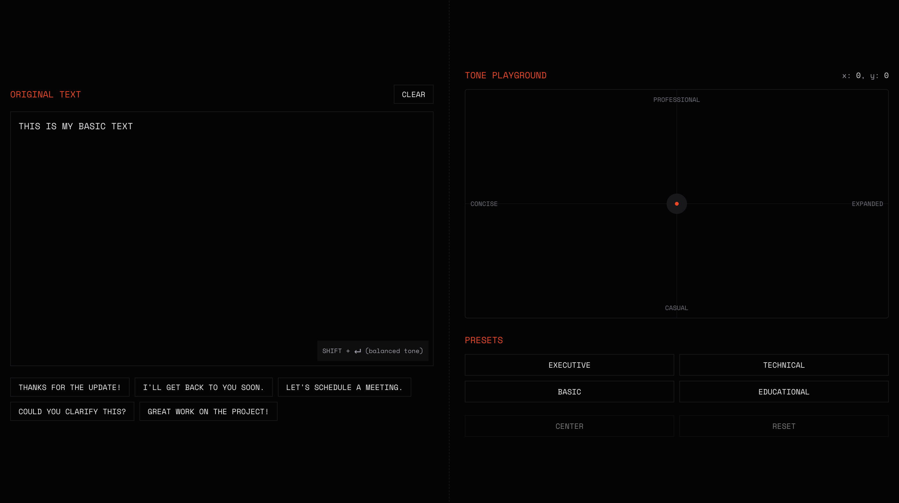

### tona → tone + a

[](https://tona-nine.vercel.app/)

a minimal prototype of figma slides' tone adjuster, with local-storage persistence and in-memory cache

### preview



📚 stack

- [next.js (typescript)](https://nextjs.org/)
- [mistral ai](https://mistral.ai/)
- [framer-motion](https://motion.dev/)
- [react-query](https://tanstack.com/query/latest)
- [tailwind css (v4)](https://tailwindcss.com/)

🔌 set-up

```bash
$ git clone https://github.com/SanyamPunia/tona.git
$ cd tona
$ pnpm install
$ pnpm dev
```

make sure to add mistral's ai api key to your `.env` file

> MISTRAL_API_KEY=...

### cache

we use a straightforward key scheme to decide whether a request should be cached.

the payload includes three core attributes: `formality`, `emotion`, and `style`.

for example, given the text “let’s schedule a meeting.”, the payload would be:

```ts
{
  "formality": "professional:39% casual:0%",
  "emotion": "expanded:0% concise:57%",
  "style": "blend:69%"
}
```

the key format is:

```bash
"text:toneKey"
```

so in this case:

```bash
"let's schedule a meeting.:professional:39% casual:0%:expanded:0% concise:57%:blend:69%"
```

a drawback of the current scheme is that small percentage differences prevent cache hits. to improve cache effectiveness, we may round attribute percentages to the nearest bucket (e.g., 10% or 25%).

one-line change example (round to nearest 10%):

```ts
const formality = `professional:${Math.round(top / 10) * 10}% casual:${
  Math.round(bottom / 10) * 10
}%`;
```

this way, values like (39, 57) and (42, 58) both normalize to (40, 60), increasing cache hit rates.

### state management

we track two main things: the original text you typed and the current text being displayed

**4 tone presets** (click to jump to that position):

- **executive** → professional + concise (top-left at -70, 70)
- **technical** → professional + expanded (top-right at 70, 70)
- **basic** → casual + concise (bottom-left at -70, -70)
- **educational** → casual + expanded (bottom-right at 70, -70)

**action buttons**:

- **center** → moves ball to (0, 0) and transforms with perfectly balanced tone
- **reset** → restores your original typed text and centers the ball (no api call)

**keyboard shortcuts**:

- **shift + enter** → quick transform with balanced tone

**persistence**:

- original text is saved to localStorage under the key `"tona-text"`
- ai transformations are temporary (not saved)
- clear button removes text from storage

### error management

we use **sonner** for all notifications (success + errors) in a consistent bottom-right toast format.

**error flow**:

- api errors are caught by react-query's `useMutation`
- `useEffect` watches for `mutation.error` changes
- when error detected → displays toast with error message → auto-clears error state
- toasts auto-dismiss after 5 seconds

**error sources**:

- missing/invalid mistral api key → "api key not configured"
- empty text input → "text must be a non-empty string"
- text over 5000 chars → "text exceeds maximum length"
- mistral api failures → shows mistral's error message
- network errors → "failed to transform text"
